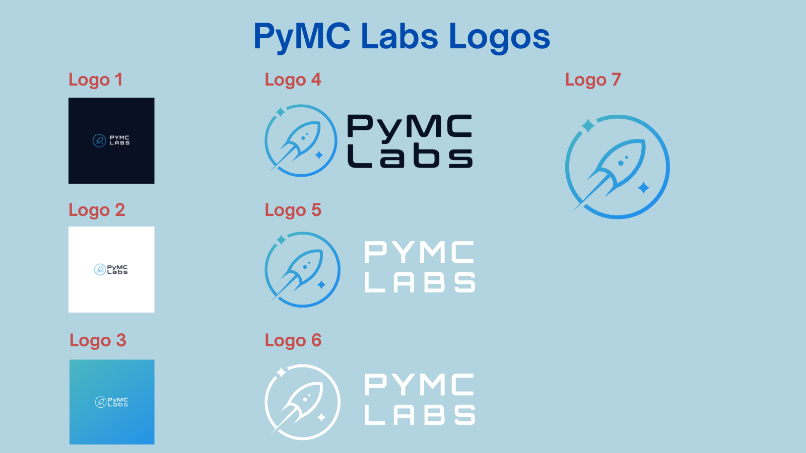

# PyMC Labs Branding

This section contains PyMC Lab's branding standards and guidelines.

---

## PyMC Labs: Logo & Font

### Font
- [Conthrax typeface](https://www.myfonts.com/search/conthrax/)
- To purchase the font: [Conthrax](https://www.fontspring.com/fonts/typodermic/conthrax)

### Colors
- unknown at this time; need to ask the designer

### Logos

 

 

#### Logo 1
- File type: JPG
- File size: 404 KB (4167 x 4168 px)
- File name: [1-pymc-labs-black.jpg](https://github.com/pymc-labs/brand/blob/master/logos/1-pymc-labs-black.jpg)

 

#### Logo 2
- File type: JPG
- File size: 404 KB (4167 x 4167 px)
- File name: [2-pymc-labs-white.jpg](https://github.com/pymc-labs/brand/blob/master/logos/2-pymc-labs-white.jpg)

 

#### Logo 3
- File type: PNG
- File size: 50 KB (1651 x 560 px)
- File name: [3-pymc-labs-transp-black.png](https://github.com/pymc-labs/brand/blob/master/logos/3-pymc-labs-transp-black.png)

 

#### Logo 4
- File type: PNG
- File size: 88 KB (2620 x 923 px)
- File name: [4-pymc-labs-transp-white.png](https://github.com/pymc-labs/brand/blob/master/logos/4-pymc-labs-transp-white.png)

 

#### Logo 5
- File type: PNG
- File size: 52 KB (2620 x 923 px)
- File name: [5-pymc-labs-all-white.png](https://github.com/pymc-labs/brand/blob/master/logos/5-pymc-labs-all-white.png)

 

#### Logo 6
- File type: PNG
- File size: 94 KB (926 x 923 px)
- File name: [6-pymc-labs-favicon.png](https://github.com/pymc-labs/brand/blob/master/logos/6-pymc-labs-favicon.png)

---

## PyMC Labs: Banner Design Templates

### Font
- [Eurostile Bold](https://freefontsvault.com/eurostile-font-family-free/)
- [Montserrat Bold](https://freefontsvault.com/montserrat-font-family-download-free/)

### Color Palette

 
#34C4D9 | #25BBE7 | #1AB0E8 | #0A96F6 | #0379EA | #005BD2

### Color Palettes: Individual

 `RGB (52,196,217) | HEX #34C4D9 | light turquoise`  
More info: [#34c4d9](https://www.color-hex.com/color/34c4d9)

 `RGB (37,187,231) | HEX #25BBE7 | sky Blue`  
More info: [#25bbe7](https://www.color-hex.com/color/25bbe7)

 `RGB (26,176,232) | HEX #1AB0E8 | sky Blue`  
More info: [#1ab0e8](https://www.color-hex.com/color/#1ab0e8)

 `RGB (10,150,246) | HEX #0A96F6 | Blue`  
More info: [#0a96f6](https://www.color-hex.com/color/0a96f6)

 `RGB (3,121,234) | HEX #0379EA | Blue`  
More info: [#0379ea](https://www.color-hex.com/color/0379ea)

 `RGB (0,91,210) | HEX #005BD2 | Blue`  
More info: [#005bd2](https://www.color-hex.com/color/005bd2)

---

### Reference
- [color-hex](https://www.color-hex.com): Glossary of Color Palettes
